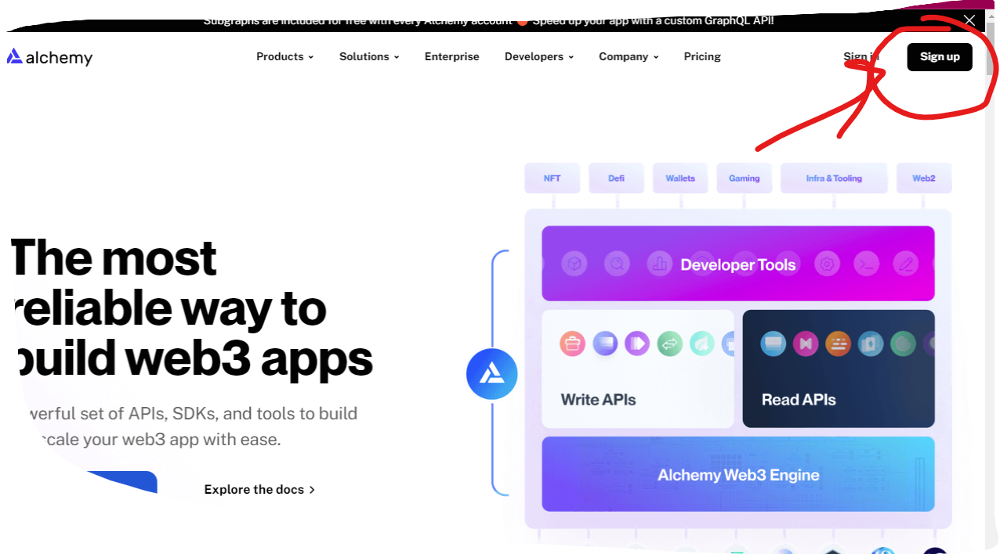
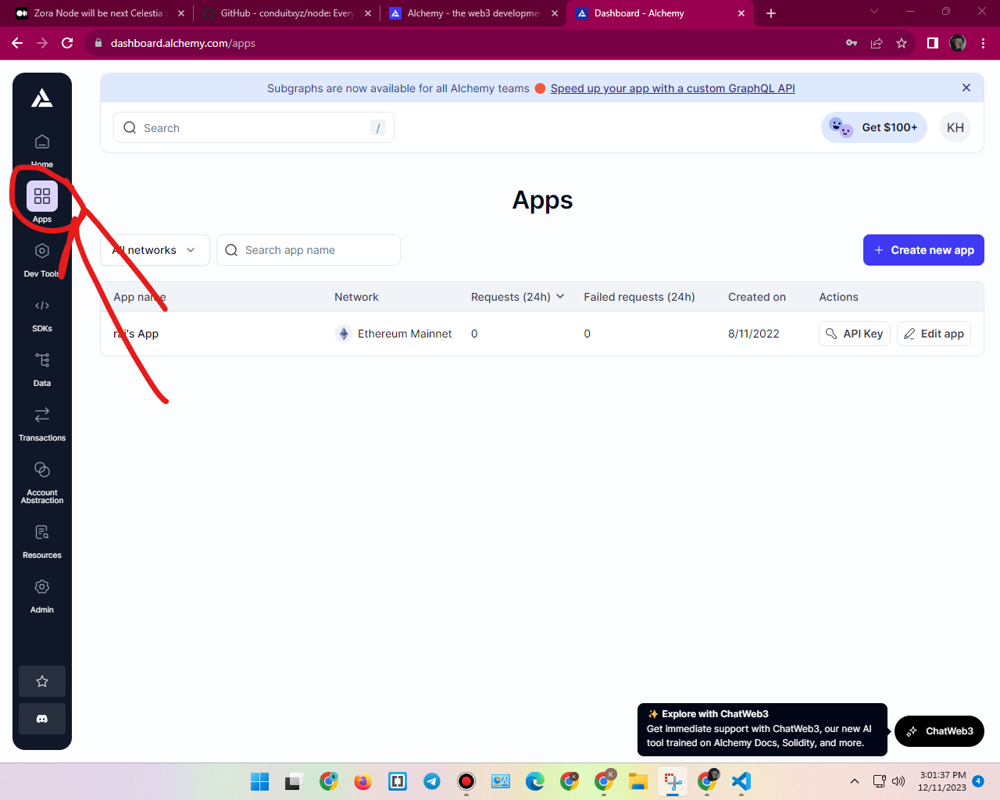
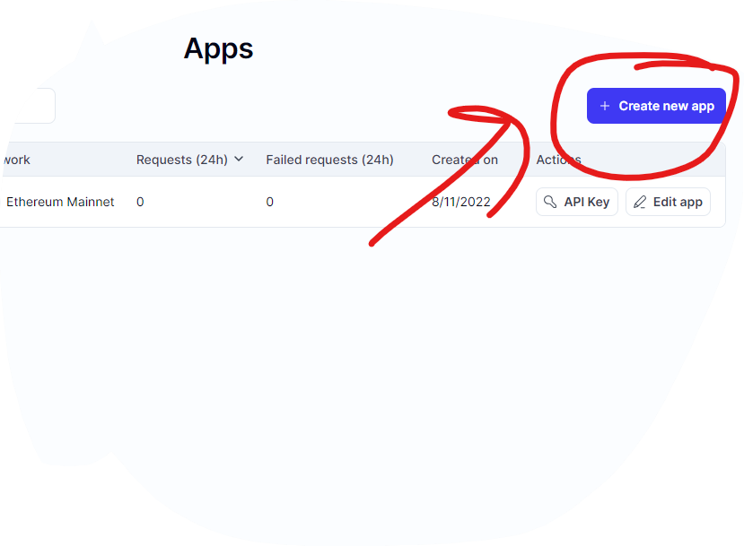
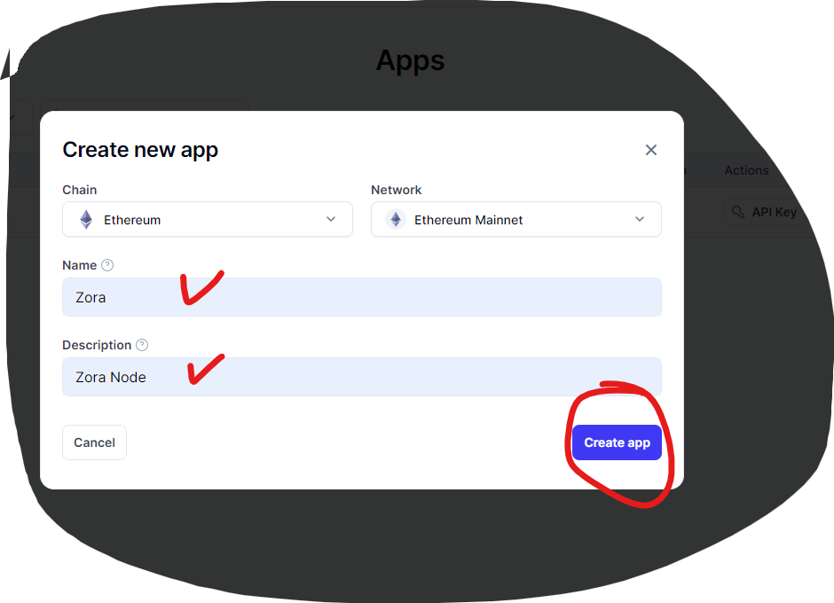
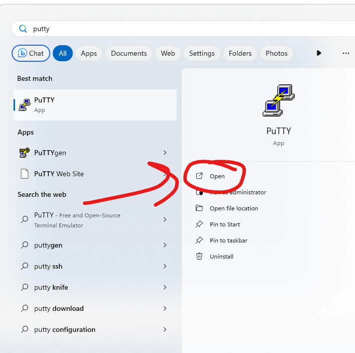
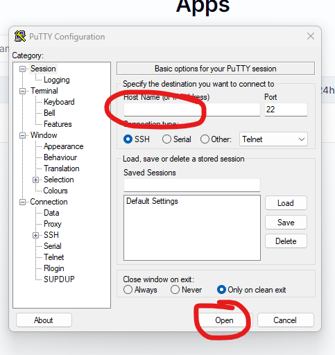
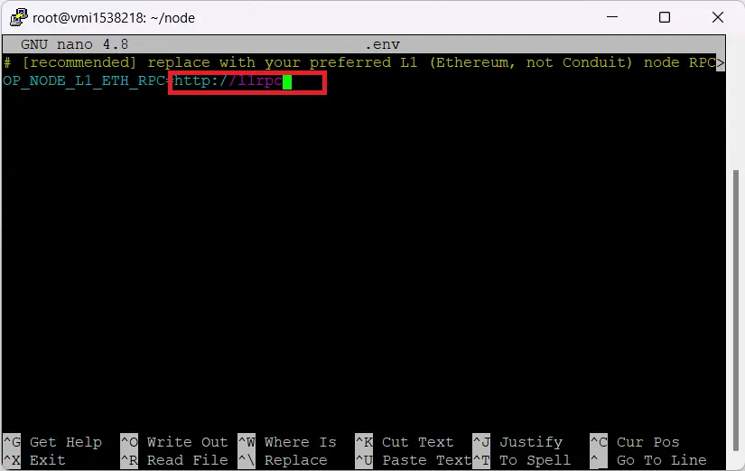
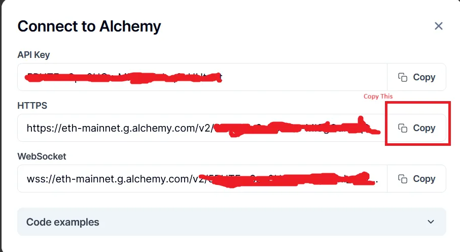

Zora Node

 official news: 
 
 https://twitter.com/ourZORA/status/1726650361212215790

 vps buy link: 

 https://contabo.com/en/vps/

 payment Accept:  paypal / master card 

 price : $22+

 

 Another link : 

 https://pq.hosting/en/#gb

 payment Accept: crypto / master card 

 price : $40+

 download putty softer : 

 https://www.putty.org/

Creating Alchemy Account For API :

Go to https://www.alchemy.com/ and click on Sign up in the top-right corner.

Fill your Deatils 

Verify your Email and Log in account

now Go Apps 

Create New apps 

Fill Deatils 

Now Open Putty Apps 

Enter your ip address and click (Open)

Follow All command step by step 

1/ 

sudo apt-get update && sudo apt-get upgrade -y

2/

sudo apt install curl build-essential git screen jq pkg-config libssl-dev libclang-dev ca-certificates gnupg lsb-release -y

3/

sudo install -m 0755 -d /etc/apt/keyrings
curl -fsSL https://download.docker.com/linux/ubuntu/gpg | sudo gpg --dearmor -o /etc/apt/keyrings/docker.gpg
sudo chmod a+r /etc/apt/keyrings/docker.gpg

4/

echo \
  "deb [arch=$(dpkg --print-architecture) signed-by=/etc/apt/keyrings/docker.gpg] https://download.docker.com/linux/ubuntu \
  $(. /etc/os-release && echo "$VERSION_CODENAME") stable" | \
  sudo tee /etc/apt/sources.list.d/docker.list > /dev/null
sudo apt-get update

5/

sudo apt-get install docker-ce docker-ce-cli containerd.io docker-compose -y

6/ Clon github 

git clone https://github.com/conduitxyz/node.git

7/

cd node

8/

./download-config.py zora-mainnet-0

9/

export CONDUIT_NETWORK=zora-mainnet-0

10/

cp .env.example .env

11/ 

nano .env

12/

Replace<http://11rpc> with your Alchemy Account API key (HTTPS)

copy 
